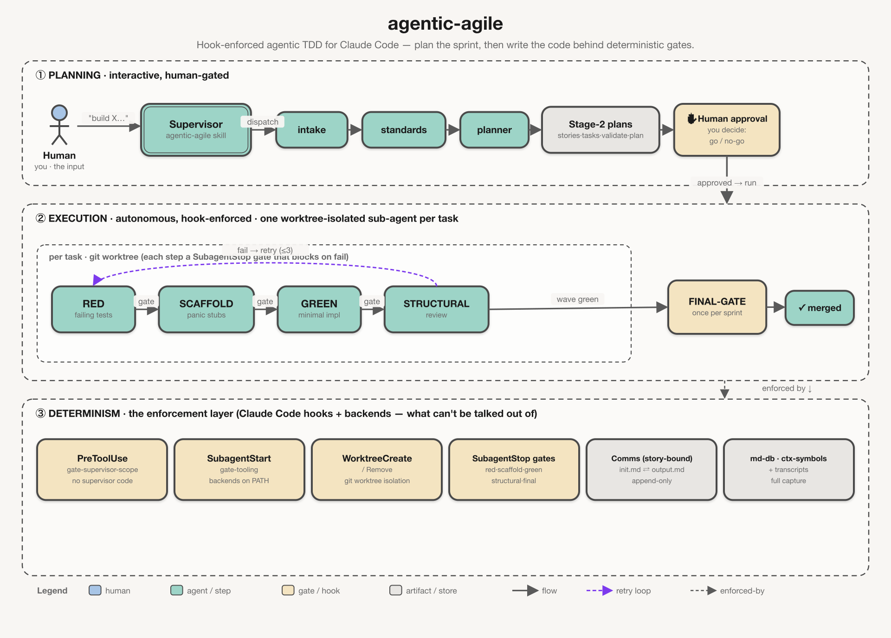

<div align="center">
  
  # 🤖 agentic-agile
  
  ### Agentic agile + autonomous TDD for Claude Code — AI coding agents that plan your sprint, then write the code with hook-enforced, deterministic gates.
  
  [](LICENSE)
  [](https://github.com/adeelahmad/agentic-agile/actions/workflows/ci.yml)
  [](https://docs.anthropic.com/en/docs/claude-code)
  [](CONTRIBUTING.md)
  [](https://github.com/adeelahmad/agentic-agile/stargazers)
  
  *Determinism comes from hooks, not model goodwill.*
  
  </div>
  
  ---
  
  <div align="center">
    
  </div>
  
  ---
  
  # agentic-agile

A Claude Code **plugin marketplace** containing the `agentic-agile` plugin:
**two-stage agile planning** (interactive, human-gated) followed by **two-phase TDD
execution** (autonomous, hook-enforced). Determinism comes from hooks, not model
goodwill — every sub-agent stop is intercepted by a deterministic gate that can
block the stop and feed the failure reason back to the supervisor.

> This repository is self-contained and publishable as-is. The plugin lives in
> [`plugin/`](plugin/); the marketplace catalog is
> [`.claude-plugin/marketplace.json`](.claude-plugin/marketplace.json).

## Quick start

```bash
# 1) Build + install the gate backends (ctx-symbols + md-db, both from source)
#    requires a Rust toolchain >= 1.82 (rustup.rs or `brew install rust`)
./plugin/tools/install.sh
#    ensure ~/.local/bin (or ~/.cargo/bin) is on PATH

# 2) Add the marketplace and install the plugin (inside Claude Code)
/plugin marketplace add adeelahmad/agentic-agile
/plugin install agentic-agile@agentic-agile-marketplace
#    (for local dev, point marketplace add at your checkout instead: ./path/to/repo)
```

## Using it

The plugin ships one skill — **`agentic-agile`** — which acts as the *supervisor*. You
don't invoke the 9 sub-agents or the gates directly; the skill dispatches them and
reacts to gate verdicts. Two ways to start it inside Claude Code:

- **Just ask.** The skill is model-invoked, so it auto-triggers on build / ship /
  implement / add-a-feature / fix-via-TDD requests — even if you never say "agile":

  ```
  Build a rate limiter as a sprint with strict TDD.
  Plan and implement the CSV export feature — tests first, with gates.
  ```

- **Explicitly**, via the namespaced entry-point command:

  ```
  /agentic-agile:init
  ```

  (`init` is a thin alias that loads the same supervisor playbook; the underlying
  skill is also directly invokable as `/agentic-agile:agentic-agile`.)

Once started:

1. **Planning (you're in the loop):** intake → standards → planner produce the sprint
   contract + per-story `tasks.md` / `validate.md` / `plan.md`. The skill **stops for
   your approval** — it will not start building until Stage-2 is approved.
2. **Execution (autonomous):** after approval it runs RED → SCAFFOLD → GREEN →
   STRUCTURAL-REVIEW per wave, then a once-per-sprint FINAL-GATE, each enforced by a
   deterministic hook gate.

The gate backends (`ctx-symbols`, `md-db`) must be on PATH — see step 1 above. Without
them the gates WARN and fall back to grep (never a false block, never a silent pass).

## What it does

- **Planning** (human present, one sprint at a time): the supervisor *dispatches* the
  `intake` → `standards` → `planner` agents to produce the sprint contract + per-story
  `tasks.md` / `validate.md` / `plan.md` — then stops for your approval.
- **Execution** (human absent): per wave, RED → SCAFFOLD → GREEN → STRUCTURAL-REVIEW,
  then once per sprint a FINAL-GATE. One **git-worktree-isolated** sub-agent per task
  (isolation works out of the box via the plugin's `WorktreeCreate`/`WorktreeRemove`
  hooks); merge on pass, abandon the chain on a foundation-poisoning halt.
- **Determinism is structural, not vibes.** Hooks enforce the invariants the model
  can't talk its way past: the supervisor can't write production source
  (`gate-supervisor-scope`), can't start execution with its backends missing
  (`gate-tooling`), can't drop worktree isolation, and can't pass a sub-agent stop whose
  gate failed (`gate-red/scaffold/green/structural/final-verify`).
- **Agent comms** are a story-bound, append-only `init.md` ⇄ `output.md` pair: the
  supervisor appends each dispatch's contract, the agent appends its report — the full
  negotiation history, enforced (`validate_comms` blocks a dispatch that left no report).
- **Transcripts**: full capture — every tool call's input *and* output, every user
  prompt, and a complete session snapshot (all messages + thinking) per task, plus a
  thin cross-task causal stream. Each sub-agent gets a READ-ONLY slice; the supervisor
  reads the whole store.
- **Retrospective + memory**: every planning session distills recurring failures (and
  your own insights) into `docs/agents/memory.md`, injected into each sub-agent's contract.

Full operator playbook: [`plugin/skills/agentic-agile/SKILL.md`](plugin/skills/agentic-agile/SKILL.md).

## Token efficiency (a measured run)

**TheNoteBook** — a full Go backend — was built with this plugin from a `README` +
`/agentic-agile:init` + a handful of prompts. Measured directly from the Claude Code
transcript and the resulting repo:

| Metric | Value |
|--------|-------|
| **Output tokens** | **~1.55M** total |
| **Model mix** (by output) | **76% Sonnet 4.6 · 24% Opus 4.8** |
| Agent turns | ~1,140 |
| Input cache hits | **99.9%** — 135M cache-read vs 0.11M fresh read |
| **Produced** | 18 internal packages · ~6.1K LOC production Go + ~11.3K LOC tests · **322 tests** · 74 commits across 6 sprints |

That's a fully-tested ~17K-LOC backend for **~1.5M output tokens**. The leanness is
structural, not luck:

- **Scoped context per worker** — each sub-agent runs in its own git worktree carrying
  only its task's contract (`init.md`) + the tests, never the whole repo, so cheaper
  models (Sonnet did 76% of the work) handle most tasks.
- **Gates verify deterministically** — `validate_comms`, `ctx-symbols`, `md-db`, and the
  RED/GREEN/structural checks replace expensive model reasoning and re-reads.
- **Caching covers ~99.9% of input**, and the hooks keep the orchestrator cheap by
  blocking it from doing the context-heavy work itself.

These mechanisms are codebase-agnostic — greenfield is simply what's measured here.

## Prerequisites

| Tool | Required? | Purpose | Install |
|------|-----------|---------|---------|
| **ctx-symbols** | recommended | symbol uniqueness (`count==1`) + duplicate/orphan detection | `./plugin/tools/install.sh` (builds from `plugin/tools/ctx-symbols`) |
| **md-db** | recommended | validates `.md` artifacts against `plugin/schemas/*.kdl` | `./plugin/tools/install.sh` (builds from vendored `plugin/tools/md-db`, AGPL-3.0) |
| **Rust toolchain** | required to install | builds both backends; also runs the target repo's fmt/clippy/test/coverage matrix | rustup (>= 1.82) |

Both backends are optional: absent → gates WARN and fall back to grep (never a false
block, never a silent pass). See [`plugin/README.md`](plugin/README.md) for the gate
env-contract and how to retarget a non-Rust repo.

## Layout

```
.claude-plugin/marketplace.json   marketplace catalog (source: ./plugin)
plugin/                           the installable plugin (see plugin/README.md)
docs/                             design + architecture docs for this plugin
  ARCHITECTURE.md DESIGN.md PLATFORM-NOTES.md KICKSTART.md
  agentic-agile-design.html diagrams/
DEVLOG.md                         build journal + review dispositions
```

## Development (Makefile)

`make` (no target) prints all targets. Common ones:

```bash
make install        # build + install ctx-symbols and md-db to ~/.local/bin
make link           # register THIS repo as a local marketplace and install the plugin
make ci             # everything CI runs: fmt-check · lint · test · eval-validate
make test           # ctx-symbols + md-db unit tests
make lint           # clippy -D warnings + shellcheck + JSON sanity
make validate       # claude plugin validate ./plugin --strict
make eval-validate  # validate every eval suite's JSON (no tokens)
make eval SUITE=…   # run one eval suite live (YES=1 spends tokens; see scripts/eval/)
make hooks          # install the tracked git hooks (.githooks → core.hooksPath)
make smoke          # offline gate smoke test
make release        # verify (ci+validate+version-check) then tag vX.Y.Z
make publish        # push branch + tags to origin
```

Git hooks (opt in with `make hooks`): **pre-commit** runs `fmt-check · json ·
eval-validate · version-check` (fast, no tokens); **pre-push** runs the full
`make ci` (`fmt-check · lint · test · eval-validate`). Bypass with `SKIP_HOOKS=1`
(e.g. `SKIP_HOOKS=1 git commit …`) for an intentional WIP commit or a known-failing
local dependency.

## Versioning & changelog

[SemVer](https://semver.org); see [`CHANGELOG.md`](CHANGELOG.md). Keep the version in
`plugin/.claude-plugin/plugin.json`, `plugin/tools/ctx-symbols/Cargo.toml`, and the
top `CHANGELOG.md` entry in lockstep — `make version-check` (and `make release`)
enforce this. Tag releases `vMAJOR.MINOR.PATCH`.

## First publish

```bash
git init && git add -A && git commit -m "agentic-agile v0.1.0"
git remote add origin <your-repo-url>
make hooks          # optional: enable local git hooks
make ci             # green before tagging
make release        # tags v0.1.0
make publish        # pushes branch + tags
```

## Continuous integration

`.github/workflows/ci.yml` runs on every push/PR:

- **ctx-symbols** — `cargo fmt --check`, `cargo clippy -D warnings`, `cargo test`.
- **shellcheck** — lints every gate script (`plugin/bin/*`), errors fail the build.
- **plugin validate** — JSON sanity on the manifest + marketplace, then
  `claude plugin validate ./plugin --strict` (installs the Claude Code CLI).

## Status

Published at [github.com/adeelahmad/agentic-agile](https://github.com/adeelahmad/agentic-agile).
The standards matrix targets **Rust** by default (retarget by editing `standards.md` +
the gates — see [`plugin/README.md`](plugin/README.md)). Gate bodies are unit-tested and
verified offline (positive + negative); CI runs `plugin validate` but not a live session,
so smoke-test the hook wiring in a real Claude Code session before relying on it
end-to-end.

## License

MIT — see [`LICENSE`](LICENSE). `ctx-symbols` is harvested from the MIT-licensed
`ctxconfig` code-intelligence layer (see `plugin/tools/ctx-symbols/README.md`).

`plugin/tools/md-db/` is **vendored third-party source under AGPL-3.0-or-later**
([decisiongraph/md-db-rs](https://github.com/decisiongraph/md-db-rs)), kept under its
own [`LICENSE`](plugin/tools/md-db/LICENSE). It is built into a standalone `md-db`
binary the gates shell out to — the MIT plugin code links to none of it — but anyone
redistributing this repository must honor AGPL-3.0 terms for that subtree.
