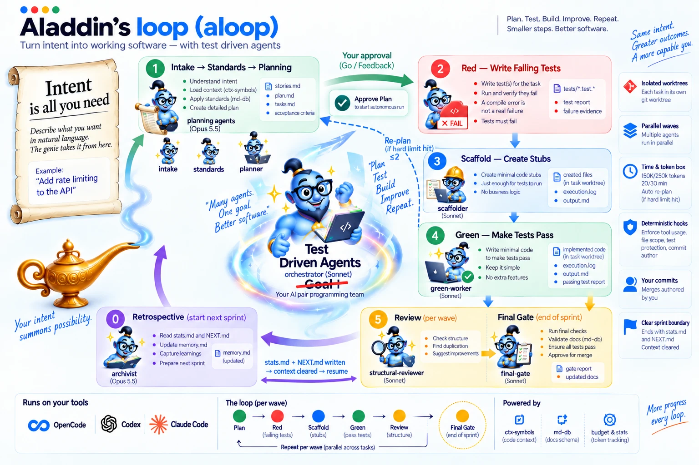

# Roadmap — agentic-agile → Aladdin

*Internal working document. Revision 0.2 of the Aladdin spec, reduced to what is **not built yet**.*

---

## 1. Goal

Evolve **agentic-agile** into **Aladdin**. Aladdin is an intent-driven, test-driven, cross-harness system for software engineering. It takes anything from a one-line request to a full specification and turns it into planned, tested, reviewed and auditable software.

- **Public thesis:** *Intent is all you need.*
- **Technical thesis:** *Do not merely give an agent a goal. Give it a failing proof of what is missing, then make it earn GREEN.*
- **Key line:** *Models explore. Gates decide.*

**Out of scope for this roadmap:**
- harness or workflow synthesis;
- personas invented per mission;
- non-software workflows;
- a Mission OS;
- building an enterprise knowledge graph (Aladdin only consumes one through a provider seam);
- IDE or human-facing LSP features.

## 2. Baseline — already shipped (v0.10.x), not repeated below

| Area | Shipped |
|---|---|
| Roles and TDD | The nine fixed roles, RED → SCAFFOLD → GREEN → STRUCTURAL-REVIEW → FINAL-GATE, and parallel waves |
| Determinism | Hook gates (`gate-*`), KDL-backed `md-db` schema validation, `ctx-symbols` scaffold and duplicate checks, and a supervisor-scope guard |
| Isolation | One git worktree per task. Merge happens only on a pass; killed or failed worktrees are discarded. |
| Hosts | Claude Code (reference), Codex and OpenCode. The same gates run through `host-adapter`, and the non-Claude hosts get generated agents and skills. |
| Approval | Reviewed mode: Stage-1 with the human, then approval of the full Stage-2 plan, then an autonomous run |
| Per-attempt budget | Soft and hard limits on tokens and wall-clock time. At the hard limit the attempt is stopped and the task is split by the planner (≤ `MAX_REPLANS`), never retried as-is. |
| Sprint boundary | The harness writes `stats.md` and `NEXT.md`. Context is cleared or a new session starts, and the SessionStart hook reloads the handoff. The planner keeps sprints self-contained. |
| Telemetry | A harness token ledger (in / cache read / cache write / out, by role and by model), attempts, gate blocks, kills, re-plans and human messages |
| Evidence | `init.md`, `output.md`, `plan-ready.md`, `execution.log`, `memory.md`, full transcripts and git history |
| Memory | The retrospective (`archivist`) promotes recurring lessons into `memory.md` |
| Model routing | Per role: planning agents on `claude-opus-5-5`, workers on `sonnet`, overridable in `defaults.md` |
| Project init | Limits, models, `.gitignore`, whether `docs/agents` is tracked, and commit authorship (the human's) are confirmed, then written to `docs/agents/defaults.md` |

## 3. Changes to existing behaviour

These parts already exist but their semantics must change:

1. **The soft token limit becomes telemetry only.** Today the worker is told to wrap up. Instead:
   - emit `task.token_soft_limit` and record it;
   - let the worker continue;
   - feed the event to the *next* planning cycle.

   Graceful wrap-up stays for the *time* soft limit only.
2. **The token meter counts classes separately.** Today it measures context in use plus output. Change the default task-length charge to *fresh input + output*, and keep cache read and cache write visible for cost and churn. Never confuse cumulative cache traffic with context size.
3. **Budgets cover every model role.** Today only `red-worker`, `scaffolder` and `green-worker` are metered. Extend the meter to planners, reviewers and `final-gate`, with a limit profile per role.
4. **Hard breaches are classified, not always split.** The planner must first classify the breach, then act:

   | Class | Action |
   |---|---|
   | `TASK_TOO_LARGE` | Split into smaller independently testable tasks |
   | `AGENT_LOOPING` | Reframe the task and inject the failed-strategy evidence |
   | `PLAN_AMBIGUOUS` | Repair the contract |
   | `BLOCKED_DEPENDENCY` | Schedule the dependency first |
   | `ENVIRONMENT_SLOW` / `TEST_SUITE_SLOW` | Adjust commands or the time budget (splitting may be useless) |
   | `EXTERNAL_SERVICE` | Isolate or mock it |
   | `HOST_FAILURE` | Retry the infrastructure, not the implementation |
   | `CONTEXT_PATHOLOGY` | Rotate or narrow the context |
   | `UNKNOWN` | Conservative re-plan, or escalate |

   Replacement tasks must fit the normal time and token budgets, and vertical slices are preferred.
5. **No post-kill narration.** After the hard stop, do not spend model tokens asking the worker for a report. Today the worker is allowed a final `output.md` append, and that allowance should go.
6. **Abstract model routes.** Roles map to `strongest | strong | economical`, and each host resolves those to concrete IDs.

## 4. New work

### 4.1 Intent normalization

- **An internal Intent Contract** produced by `intake`. The user never fills it in. Fields:
  - `intent_id`
  - `source` (prompt | file | issue | image | mixed)
  - `actor`, `want`, `why`
  - `constraints`
  - `success_scenarios`, `failure_scenarios`
  - `connections`
  - `done_looks_like`
  - `open_questions`, `assumptions`
  - `provenance`
- **Clarification policy:**

  | Uncertainty | Handling |
  |---|---|
  | Safe and reversible | Planner assumes and records the assumption |
  | Material but recoverable | Planner picks a default and surfaces it in the approval summary |
  | Irreversible, security-sensitive, or changes intent | Ask the human |
  | Unknown but testable | Create a spike task |

- **Autonomous mode**, explicit at run start: generated plan → deterministic planning checks → execution, with no approval unless an escalation class is hit. Reviewed mode stays the default.

### 4.2 Sprint budget and admission control

- A sprint aggregate token envelope (soft/hard).
  - **Soft:** a rollover warning. Optionally, stop starting non-critical work.
  - **Hard:**
    - close admission;
    - let in-flight tasks finish under their own limits;
    - carry not-started tasks to the next planning cycle;
    - record the reason.

    A rollover is **not** a failure.
- Time budget `auto` mode: the planner proposes one stable task duration per project (with a min/max), recorded by the supervisor. It is revised only when there is evidence.
- An interruptible orchestrator loop: *sleep → wake on event → inspect → accept / retry / preempt / replan / rollover / spawn → sleep*. The orchestrator spends no tokens watching workers.

### 4.3 Planning feedback lifecycle

- **A minimal failure envelope for the planner.** It carries:
  - the task, attempt, role and limit type;
  - the observed value;
  - the last gate result, changed symbols and a test summary;
  - references to the transcript, events, `output.md`, diff and tests.

  Deeper evidence is retrieved on demand, never injected by default.
- **Grace rule:**
  - 0–1 failed or hard-breached tasks in a sprint → no nudge.
  - 2 or more → one concise "plan smaller" nudge for the **next planning cycle only**.
- **Calibration verdict:** when many tasks breach, the planner recommends one of:
  - keep the budget and plan smaller;
  - raise the time budget;
  - raise the token budget;
  - reduce context;
  - fix the environment.

  Persistent changes are recorded.
- **Planner lesson candidates** use `symptom / cause / change / applies_to / evidence_refs`. Promotion to `memory.md` goes only through the existing archivist recurrence rule. There is no second memory system.

### 4.4 Context boundary: completing the model

- A **canonical sprint handoff** built from accepted state. It records completed refs, accepted commits, open and carried work, invariants, the semantic targets needed next, decision and evidence refs, and the transient nudge. It references evidence and never inlines transcripts. `NEXT.md` becomes a rendered view of it.
- **Compaction detection:** use explicit host compaction only when the adapter advertises it. Otherwise rotate to a fresh session, which is the correctness path. Keeping a session open across a boundary needs a recorded reason.
- **Resume rule:** resume from git, artifacts, lineage, gate evidence and the handoff, never from "the agent said done". If evidence is missing, re-run the gate.

### 4.5 Identity and referential integrity

- Models keep emitting short aliases (`S1-03`, `T2`, `C7`). On ingest the orchestrator:
  1. issues canonical IDs (ULID / UUIDv7);
  2. rewrites **structured** references (never regex over prose);
  3. validates the reference graph;
  4. freezes the mapping.
- A cross-artifact referential check becomes a gate alongside the existing `md-db` schema gate.

### 4.6 Semantic execution map

- **Structured change targets:**
  - `change_ref`
  - `operation` (create | modify | extend | refactor | replace | delete)
  - `path`, `symbol` / `planned_symbol`
  - `reason`, `evidence_refs`, `constraints`
- **A virtual/shadow workspace:** the real tree plus planned files and symbols. It is queryable before the code exists, and no physical stubs are created in the accepted tree.
- **An LSP/structural adapter seam**, using only symbols, references, incoming/outgoing call hierarchy and rename/workspace-edit preview. Missing backend capability is surfaced, never guessed.
- **A narrow-context CLI:** `target`, `refs`, `callers`, `callees`, `context <ref> --budget N`. Workers start from the resolved target instead of scanning the repo.
- **The semantic plan becomes the execution source.** `plan.md`, `tasks.md` and the rest become deterministic views over it. Derive anything that can be derived.

### 4.7 Provenance and lineage

- **A normalized event stream** (`aladdin.event/1`) for the events listed in the table below. Its envelope carries IDs, `parent_event_id` / `caused_by`, role, host, model, authority, decision, and artifact and evidence refs. It references transcripts and never copies them.
- **Structured decision rationale** at durable boundaries (plan, split, target, implementation, replan, acceptance). Each record gives a one-line reason, evidence refs and an authority ref. There is no chain-of-thought capture.
- **An authority record per run:** `initiated_by`, policy profile, `autonomy_mode`, approved scope, overrides.
- **Lineage query:** commit → attempt → decision → gate → tests → target → planner decision → story → intent → human prompt → approver, with no transcript archaeology.
- **Commit messages** built from task and change rationale.
- **Graph-export compatibility.** The graph stays downstream and rebuildable; the event stream is the source of truth.

Event types:

| Group | Events |
|---|---|
| Intent and plan | `intent.received`, `intent.normalized`, `plan.created`, `plan.approved`, `plan.revised` |
| Sprint and context | `sprint.started`, `sprint.token_soft_limit`, `sprint.admission_closed`, `sprint.rolled_over`, `sprint.context_handoff`, `context.compacted`, `context.rotated` |
| Tasks | `task.created`, `task.dispatched`, `task.completed`, `task.retry`, `task.time_soft_preempt`, `task.time_hard_timeout`, `task.token_soft_limit`, `task.token_hard_limit`, `task.cancelled` |
| Gates and worktrees | `gate.started`, `gate.passed`, `gate.failed`, `worktree.created`, `worktree.discarded`, `worktree.merged` |
| Artifacts and decisions | `artifact.created`, `artifact.updated`, `semantic_target.created`, `semantic_target.resolved`, `decision.recorded`, `commit.created` |
| Memory | `memory.candidate`, `memory.promoted`, `memory.retired` |
| Human and run | `human.approval`, `human.override`, `run.completed`, `run.aborted` |

### 4.8 Cross-project impact provider seam

An optional MCP/provider contract that planners may query for:
- downstream consumers;
- historical rationale;
- migration and deprecation order;
- organization standards.

Results carry source refs and are attached to planning provenance. An unavailable provider is surfaced, and local execution continues. Aladdin does not build the index.

### 4.9 Portable host core

- **Extract a `HostAdapter` interface:**
  - `Capabilities`
  - `Spawn` / `Wait` / `Send` / `Cancel`
  - `Subscribe`
  - `ResolveModel` / `ResolveTranscript`
  - `Usage` / `ContextPressure` / `Compact` (optional) / `RotateSession`
  - worktree create / remove / diff
  - `InstallGate` / `EnforceGate`
  - `ToolPolicy`

  Claude Code is the reference implementation, and Codex and OpenCode become adapters behind it.
- **Usage reporting** distinguishes fresh input, output, cache read, cache write and current context against the context window. Estimated counts are marked `estimated`.
- **A host capability matrix** covering usage, compaction, live messaging (for the time soft-stop), lifecycle and gate blocking.
- **Gate equivalence:** if a host cannot block natively, the outer controller enforces it. Never downgrade BLOCK to WARN.
- **A portable project config** in `.aladdin/config.yaml` (budgets, context, semantic, models, provenance, memory), replacing `docs/agents/defaults.md` with a migration path.
- **Host swap:** a sprint started on one host resumes on another from portable state.

### 4.10 Metrics

The run report should add:
- time soft preemptions;
- sprint admission closures and rollovers;
- context peak and context-window share;
- context rotations and compactions;
- breaches by role and by class;
- p50/p90/p95 task duration and tokens;
- tests added and commits produced;
- semantic context served and full-repo scans avoided.

Derived metrics:
- tokens per accepted task and per accepted story;
- first-pass rates for RED, GREEN and gates;
- hard-breach waste;
- cache-hit and churn ratios;
- replan rate.

No extra model calls are made just for telemetry.

### 4.11 Rebrand and product surface (last)

- **New entry points:** `/aladdin` and an `aladdin` CLI (`"<intent>"`, `run`, `status`, `resume`, `report`, plus the semantic queries). Natural-language auto-trigger inside hosts.
- **Compatibility aliases for one migration window:**
  - `/agentic-agile:init`
  - the `agentic` command
  - the `agentic-agile:*` agent prefixes
  - `.agentic/` alongside `.aladdin/`
- **README reordered, product first:**
  1. Intent is all you need
  2. Demo
  3. Test-Driven Agents
  4. How the loop works
  5. Why failing first matters
  6. Models explore. Gates decide.
  7. Install / Run
  8. Supported harnesses
  9. Evidence
  10. Audit
  11. Architecture
  12. Limitations
- **A site / GitHub Pages** with an original lamp motif (no Disney visual language), the RED explainer ("Give the agent something to make false.") and the audit tree.
- **Evidence:** every public claim links to a reproducible measured run.

## 5. Delivery sessions

Each session starts from accepted git state and its own contract, ends with accepted commits plus a handoff, and rotates context.

| # | Session | Exit criterion |
|---|---|---|
| 1 | Conformance fixtures around current behaviour, plus canonical IDs and the reference remap (§4.5) | Existing behaviour passes; accepted artifacts have stable identity |
| 2 | Budget semantics changes (§3.1–3.3, 3.5) and the sprint aggregate budget / admission control (§4.2) | Synthetic workers hit every threshold with the expected state and event transition |
| 3 | Canonical handoff, compaction detection, rotation and resume rule (§4.4) | Sprint N+1 succeeds in a fresh session from artifacts and the handoff only |
| 4 | Breach classification, failure envelope, grace rule and nudge, lesson candidates (§3.4, §4.3) | A hard breach never ordinary-retries; the nudge expires on schedule |
| 5 | Intent Contract, clarification policy and autonomous mode (§4.1) | A one-line intent runs in both modes |
| 6 | Semantic execution map (§4.6) | A worker starts from `target`/`context`, including for a file that doesn't exist yet |
| 7 | Event stream, rationale, authority and lineage query (§4.7) | Commit → intent traced without transcripts |
| 8 | Provider seam (§4.8) | Planner consumes external evidence; running without the provider still works |
| 9 | HostAdapter extraction, capability matrix, portable config, host swap, metrics (§4.9–4.10) | Two or more hosts pass the same conformance suite |
| 10 | Rebrand, README, site, migration docs (§4.11) | Public claims are backed by measured runs |

## 6. Conformance suite (every host)

1. An intent is admitted and normalized.
2. Planner artifacts are schema-valid.
3. RED is rejected if its tests pass at first run.
4. RED cannot write production code.
5. GREEN cannot suppress tests.
6. A failed gate blocks acceptance.
7. Worktrees stay isolated.
8. An accepted GREEN is mergeable.
9. Hard-breached work is discarded.
10. Transcript and event refs exist.
11. The lineage is complete.
12. Usage is exact or explicitly marked estimated.
13. Hard time and token limits stop the worker.
14. Admission closes deterministically.
15. A breached task is re-decomposed.
16. The handoff is produced and context rotated.
17. Compaction is used only when advertised.
18. The model route is observable.
19. Memory injection is equivalent across hosts.
20. Semantic capability gaps are explicit.

## 7. Invariants — never weakened

Existing invariants:
- RED fails for the expected behavioural reason and never implements production code.
- GREEN never weakens the RED proof.
- Writers are isolated.
- Failed gates are never accepted.
- Partial hard-budget work is never merged.
- The existing schema gate stays authoritative.
- The supervisor never bypasses the worker/gate path.
- Memory cannot relax an invariant.
- A missing deterministic backend is never described as full enforcement.

New with this roadmap:
- Canonical IDs are issued outside model text.
- The approval mode is explicit.
- The model and provider are recorded.
- Intent ancestry is preserved.
- Host limitations are explicit.
- A soft token limit never becomes acceptance or cancellation logic.
- Hard limits are enforced by the supervisor, not the worker.
- The sprint hard budget closes admission and rolls work forward.
- No sprint relies on hidden conversational context.
- Rotation is the boundary when compaction is unavailable.
- Semantic targets never modify the accepted tree.
- Deep failure evidence is on demand, not injected.
- External evidence is source-referenced and never treated as an invariant.

## 8. Tracking

When the work completes, report each requirement as `IMPLEMENTED_TESTED` (with evidence), `IMPLEMENTED_UNTESTED`, `BLOCKED_HOST` or `NOT_IMPLEMENTED`.
